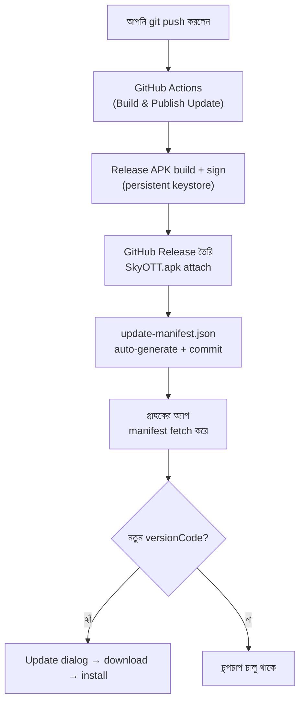

# In-App Auto Update — Setup Guide

**push করলেই build → Release → গ্রাহকের অ্যাপ নিজে থেকে update।** কোনো manual
APK upload নেই, Drive নেই, quota নেই।

---

## ✅ সেটআপ সম্পন্ন (2026-10-09)

সব কিছু তৈরি ও যাচাই করা হয়েছে। এখন থেকে **শুধু ২ ধাপ** (নিচে "নতুন version ছাড়া" দেখুন)।

| বিষয় | অবস্থা |
|---|---|
| Repo | Public ✓ |
| JDK 17 (keystore বানানোর জন্য) | ইনস্টল ✓ |
| Signing keystore | তৈরি ✓ (persistent) |
| GitHub Secrets (4টা) | set ✓ |
| প্রথম Release | `v1.1-b2` — `SkyOTT.apk` (9.18 MB) ✓ |
| Manifest auto-update | ✓ (`[skip ci]` commit) |
| APK signature ↔ keystore | ✓ **হুবহু মিলেছে** |

### 🚨 keystore-এর ব্যাকআপ নিন — এটা না হারাবেন

| File | কোথায় |
|---|---|
| Keystore | `C:\xampp\htdocs\iptv-main\iptv-main\skyott.jks` |
| Password | `%USERPROFILE%\skyott-secrets\keystore-password.txt` |

**দুটোই pendrive / private cloud-এ এখনই কপি করুন।**

> এই key ছাড়া ভবিষ্যতে গ্রাহকের অ্যাপ **আর কখনো update করতে পারবেন না** —
> সবাইকে আবার manually install করাতে হবে। `*.jks` `.gitignore`-এ আছে, তাই
> ভুলে GitHub-এ চলে যাওয়ার ভয় নেই।

---

## কীভাবে কাজ করে



| URL | কী |
|---|---|
| `https://raw.githubusercontent.com/amritokumar68888/iptv/main/update/update-manifest.json` | অ্যাপ যা চেক করে (auto-generated) |
| `https://github.com/amritokumar68888/iptv/releases/download/v1.1-b2/SkyOTT.apk` | APK download (auto) |

---

## ⚠️ আগে জেনে নিন — ২টা জরুরি কথা

### ১. এই অ্যাপে update সিস্টেম নেই — তাই প্রথমবার manually দিতে হবে

Drive/গ্রাহকের কাছে এখন যে APK আছে (v1) সেটা **পুরনো কোডে** বানানো —
**তাতে update-checker নেই**। যে অ্যাপে feature নেই, সে নিজে কখনো update চেক করবে না।

> 👉 তাই **একবার** গ্রাহককে নতুন APK manually install করাতে হবে।
> **তারপর থেকে** সব update অটোমেটিক হবে।

### ২. সবচেয়ে বড় ফাঁদ — signing key (keystore)

আগের CI workflow প্রতিবার `keytool -genkey` দিয়ে **নতুন random key** বানাত।
মানে প্রতিটা APK-এর signature আলাদা। Android একই key ছাড়া update install করে না:

```
INSTALL_FAILED_UPDATE_INCOMPATIBLE   ← signature মিলছে না
```

**তাই এখন থেকে একটাই permanent keystore ব্যবহার হবে** (GitHub Secrets-এ রাখা)।

> ⚠️ ইতিমধ্যে বিতরণ করা APK-এর key হারিয়ে গেছে (ephemeral ছিল)।
> তাই গ্রাহকদের **একবার uninstall → নতুন APK install** করতে হবে।
> এরপর থেকে আর কখনো এটা লাগবে না।

---

## একবারের setup (একবারই)

### ধাপ ১ — JDK ইনস্টল করুন

```powershell
winget install EclipseAdoptium.Temurin.17.JDK
```

তারপর **নতুন terminal** খুলুন (PATH আপডেট হওয়ার জন্য)।

### ধাপ ২ — Signing keystore বানান

```powershell
powershell -ExecutionPolicy Bypass -File tools\create-keystore.ps1
```

- এটা `skyott.jks` বানাবে এবং একটা password জিজ্ঞেস করবে
- **password ভুলবেন না** — এটাই পরে GitHub Secret-এ দিতে হবে
- শেষে `keystore-base64.txt` file বানাবে (Secret-এ paste করার জন্য)

> 🚨 `skyott.jks` ও password **কোথাও হারাবেন না**। হারালে আর কখনো
> গ্রাহকের অ্যাপ update করতে পারবেন না — সবাইকে আবার manually install করাতে হবে।
> **pendrive / private cloud-এ backup রাখুন।**

### ধাপ ৩ — GitHub Secrets যোগ করুন (৪টা)

GitHub → আপনার repo → **Settings** → **Secrets and variables** → **Actions**
→ **New repository secret** → এই চারটা যোগ করুন:

| Name | Value |
|---|---|
| `KEYSTORE_BASE64` | `keystore-base64.txt`-এর পুরো content |
| `KEYSTORE_PASS` | আপনি যে password দিয়েছেন |
| `KEY_ALIAS` | `skyott` |
| `KEY_PASS` | একই password |

### ধাপ ৪ — Repo টা Public করুন ⚠️

**Settings** → নিচে **Change repository visibility** → **Change to public**

**কেন দরকার:** private repo-র file anonymous-এ download করা যায় না — গ্রাহকের
অ্যাপ manifest/APK fetch করতে পারবে না (401/404)।

> ✅ এখন নিরাপদ: keystore password আর repo-তে নেই (Secret-এ আছে), আর
> `*.jks` `.gitignore`-এ যোগ করা হয়েছে।

### ধাপ ৫ — First release ছাড়ুন

```powershell
git add -A
git commit -m "chore: switch to GitHub-based auto update"
git push
```

Push হলেই build → Release → manifest সব automatic হবে।

---

## প্রতিবার নতুন version ছাড়া (এখন থেকে মাত্র ২ ধাপ)

### ধাপ ১ — `app/build.gradle`-এ version বাড়ান

```gradle
versionCode 3          // ⚠️ অবশ্যই বাড়াতে হবে (2 → 3 → 4 ...)
versionName "1.2"      // গ্রাহক যা দেখবে
```

> ⚠️ `versionCode` না বাড়ালে গ্রাহকের অ্যাপ update **ধরবেই না**।
> এটাই সবচেয়ে জরুরি step।

### ধাপ ২ — push

```powershell
git add app/build.gradle
git commit -m "release: v1.2 (build 3)"
git push
```

**ব্যস।** Actions নিজে:
1. signed APK build করবে
2. Release বানাবে
3. manifest আপডেট করে commit করবে
4. গ্রাহকের অ্যাপ পরেরবার খুললেই update দেখবে

> 💡 Changelog বদলাতে চাইলে: `.github/workflows/build.yml`-এর
> `Generate update manifest` step-এ `"changelog"` লাইনটা এডিট করুন।

---

## Force (বাধ্যতামূলক) update

`build.yml`-এর manifest step-এ:

```python
"forceUpdate": True,          # "Later" button থাকবে না
"minSupportedVersionCode": 2, # এর চেয়ে পুরনো হলে জোর করে update
```

---

## দুই ট্র্যাক — Play Store vs Sideload

অ্যাপ নিজেই বুঝে নেয় কোনটা দরকার (`InstallSource.isFromPlay()`):

| গ্রাহকের ফোনে অ্যাপ যেভাবে | কোন updater | "Install unknown apps"? |
|---|---|---|
| **Google Play Store** | Play In-App Updates | ❌ **কখনোই আসে না** |
| Sideload (APK কপি করা) | GitHub Release updater | ✅ একবার allow |

> Sideload-এ "Install unknown apps" prompt **কোনোভাবেই সরানো যায় না** — এটা
> Android-এর core security feature, common অ্যাপে bypass অসম্ভব।
> সম্পূর্ণ prompt-free চাইলে **Google Play**-এ publish করতে হবে।

---

## ট্রাবলশুটিং

| সমস্যা | কারণ / সমাধান |
|---|---|
| Actions fail: `KEYSTORE_BASE64 secret সেট করা নেই` | ধাপ ৩ সম্পূর্ণ হয়নি |
| `INSTALL_FAILED_UPDATE_INCOMPATIBLE` | নতুন keystore ব্যবহার হয়েছে। গ্রাহককে uninstall → reinstall করতে হবে (একবারই) |
| Update dialog আসে না | `versionCode` বাড়ানো হয়নি। অথবা repo private |
| APK download 404 | Repo private, বা Release এখনো তৈরি হয়নি |
| "Downloaded file টা APK নয়" | `apkUrl` ভুল — Release-এ `SkyOTT.apk` attach হয়েছে কি না দেখুন |
| Actions চলে কিন্তু release নেই | `permissions: contents: write` আছে কি না দেখুন |
| Manifest পুরনো মনে হচ্ছে | cache-buster আছে; raw CDN ~৫ মিনিট cache করে — একটু অপেক্ষা করুন |
| Installer "Blocked" দেখাচ্ছে | গ্রাহককে Settings → Install unknown apps → allow করতে বলুন |

---

## ফাইল-কোথায় কী

| File | কাজ |
|---|---|
| `.github/workflows/build.yml` | build → Release → manifest (পুরো automation) |
| `tools/create-keystore.ps1` | একবারের keystore তৈরি helper |
| `update/update-manifest.json` | workflow নিজে আপডেট করে — হাতে এডিট করবেন না |
| `app/build.gradle` | `versionCode` এখানে বাড়াবেন |
| `data/update/UpdateConfig.kt` | manifest URL, check interval, Play force flag |
| `data/update/UpdateChecker.kt` | নতুন version আছে কি না দেখে |
| `data/update/ApkDownloader.kt` | APK download (progress সহ) |
| `data/update/InstallHelper.kt` | installer খোলা + permission |
| `data/update/DriveClient.kt` | HTTP client + Drive confirm-page handling |
| `data/update/PlayUpdateManager.kt` | Play In-App Updates (prompt-free) |
| `data/update/InstallSource.kt` | অ্যাপ Play থেকে এসেছে কি না detect |
| `ui/update/UpdateDialog.kt` | update dialog + progress UI |

---

## দ্রুত রেফারেন্স (চিটশিট)

```powershell
# নতুন version ছাড়তে
# 1. app/build.gradle-এ versionCode বাড়ান
# 2. তারপর:
git add -A; git commit -m "release: v1.2 (build 3)"; git push

# Actions দেখতে
start https://github.com/amritokumar68888/iptv/actions

# Releases দেখতে
start https://github.com/amritokumar68888/iptv/releases
```
