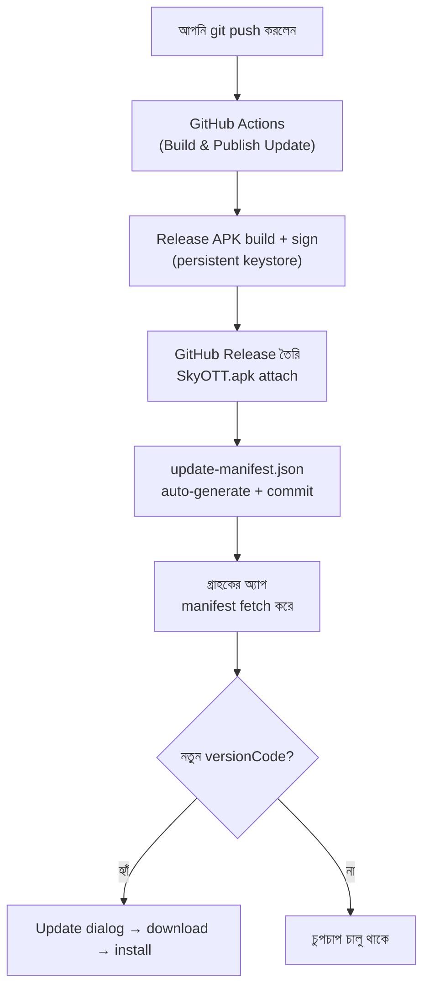

# In-App Auto Update — Setup Guide

**push করলেই build → Release → গ্রাহকের অ্যাপ নিজে থেকে update।** কোনো manual
APK upload নেই, Drive নেই, quota নেই।

---

## ✅ সেটআপ সম্পন্ন (2026-10-09)

সব কিছু তৈরি ও যাচাই করা হয়েছে। এখন থেকে **শুধু ২ ধাপ** (নিচে "নতুন version ছাড়া" দেখুন)।

| বিষয় | অবস্থা |
|---|---|
| Repo | Public ✓ |
| JDK 17 (keystore বানানোর জন্য) | ইনস্টল ✓ |
| Signing keystore | তৈরি ✓ (persistent) |
| GitHub Secrets (4টা) | set ✓ |
| প্রথম Release | `v1.1-b2` — `SkyOTT.apk` (9.18 MB) ✓ |
| Manifest auto-update | ✓ (`[skip ci]` commit) |
| APK signature ↔ keystore | ✓ **হুবহু মিলেছে** |

### 🚨 keystore-এর ব্যাকআপ নিন — এটা না হারাবেন

| File | কোথায় |
|---|---|
| Keystore | `C:\xampp\htdocs\iptv-main\iptv-main\skyott.jks` |
| Password | `%USERPROFILE%\skyott-secrets\keystore-password.txt` |

**দুটোই pendrive / private cloud-এ এখনই কপি করুন।**

> এই key ছাড়া ভবিষ্যতে গ্রাহকের অ্যাপ **আর কখনো update করতে পারবেন না** —
> সবাইকে আবার manually install করাতে হবে। `*.jks` `.gitignore`-এ আছে, তাই
> ভুলে GitHub-এ চলে যাওয়ার ভয় নেই।

---

## কীভাবে কাজ করে



| URL | কী |
|---|---|
| `https://raw.githubusercontent.com/amritokumar68888/iptv/main/update/update-manifest.json` | অ্যাপ যা চেক করে (auto-generated) |
| `https://github.com/amritokumar68888/iptv/releases/download/v1.1-b2/SkyOTT.apk` | APK download (auto) |

---

## 🛡️ Google Play Protect — install আটকে দেয়

### ⛔ যা কোনো কোড দিয়েই possible না

**Play Protect-এর স্ক্যান কোনো app থেকে বন্ধ/bypass করা যায় না।** এটা Google
Play **services**-এর ভেতরে চলে — আপনার app-এর কোনো API, permission,
manifest flag এর উপর নির্ভর করে না। যে blog/tutorial "bypass" বলে, সেটা মিথ্যা।

### ✅ যা কৰা হয়েছে

Update dialog-এ একটা helper যোগ আছে। গ্রাহক install-এর সময় আটকে গেলে ওই লেখায়

চাপ দিলেই **Play Protect সেটিংস সরাসরি খুলে যায়** — তখন দুটো tap-এ সে নিজে
"Scan apps with Play Protect" বন্ধ করে আবার install করতে পারে।

> ⚠️ এটা ব্যবহারকারীর **নিজের নিরাপত্তা-সিদ্ধান্ত** — app তাকে বাধ্য করতে বা
> তার হয়ে সেটিং বদলাতে পারে না (Android-এর ডিজাইন)।

### 🎯 গ্রাহককে যা বলবেন

| যা দেখা যায় | গ্রাহকের কাজ |
|---|---|
| **"Unsafe app blocked"** | **More details → Install anyway** |
| **"App scan recommended"** | **Install anyway** |
| **"Install blocked" (কোনো option নেই)** | Update dialog-এর লেখায় চাপ → Play Protect → Scan বন্ধ → আবার Install |
| **কিছুই আসছে না** | Settings → Google → Play Protect → Scan বন্ধ |

### 🏆 আই.একটা আসল সমাধান

**Google Play-তে publish করুন** (SECTION B দেখুন)। Play Store থেকে install করা
app-কে Play Protect **কখনো ব্লক করে না** — এবং "Install unknown apps" prompt-ও
আসে না। এটাই এই সমস্যার একমাত্র পূর্ণ সমাধান।

> 📌 এটা **অ্যাপের bug নয়** — Play Protect Google-এর security feature,
> যা সব sideloaded APK-এর জন্য সমানভাবে কাজ করে (Facebook/WhatsApp-এর
> APK-ও যদি সাইডলোড করা হয়, একই warning আসে)।

---

## IP Block — কোন IP অ্যাপ চালাতে পারবে

আগে IP টা কোডে **hardcoded** ছিল (`103.7.4.12`) — বদলাতে নতুন APK লাগত।
এখন list টা **remote file** থেকে আসে, তাই **একাধিক IP** দিতে পারবেন আর
নতুন APK ছাড়াই বদলাতে পারবেন।

### File: `update/allowed-ips.txt`

```
103.7.4.12          # exact IP — শুধু এই IP allowed
103.7.4.0/24        # CIDR — 103.7.4.0 থেকে 103.7.4.255 (256টা IP) ⭐
103.7.0.0/16        # CIDR — 103.7.0.0 থেকে 103.7.255.255 (65,536টা IP)
27.147.190.5        # আরেকটা আলাদা IP
192.168.1.*         # * — উপরের /24-এর সমান
192.168.2.          # শেষে dot — এও /24-এর সমান
# 1.2.3.4           # # দিয়ে comment — পড়া হয় না
```

| Format | মানে | কতগুলো IP |
|---|---|---|
| `103.7.4.12` | শুধু এই exact IP | ১টা |
| **`103.7.4.0/24`** | `103.7.4.0` – `103.7.4.255` | **২৫৬টা** |
| `103.7.0.0/16` | `103.7.0.0` – `103.7.255.255` | ৬৫,৫৩৬টা |
| `103.0.0.0/8` | `103.0.0.0` – `103.255.255.255` | ১ কোটি+ |
| `103.7.4.*` | `/24`-এর সমান | ২৫৬টা |
| `103.7.4.` | `/24`-এর সমান | ২৫৬টা |
| `# ...` | comment, বাদ যাবে | — |
| `1.2.3.4, 5.6.7.8` | এক লাইনে কমা দিয়ে একাধিক | — |

> ⭐ **সবচেয়ে সহজ:** `103.7.4.0/24` লিখে দিন — ওই নেটওয়ার্কের **সব** IP
> অটোমেটিক allowed, একটা একটা করে লিখতে হবে না।
>
> 💡 `103.7.4.12/24` লিখলেও একই কাজ করবে — host bits বাদ দিয়ে নেটওয়ার্ক ধরে নেয়।
>
> ⚠️ `103.7.4.0` (শুধু `/` ছাড়া) লিখলে **শুধু ওই একটা IP** allowed হবে —
> পুরো range পেতে `/24` দিতে হবে।

### বদলাতে ২ ধাপ (৩০ সেকেন্ড)

**১.** GitHub-এ file টা খুলুন → **✏️ পেন্সিল** আইকন → IP বদলান
```
https://github.com/amritokumar68888/iptv/blob/main/update/allowed-ips.txt
```
> git/push জানার দরকার নেই — browser-এ ক্লিক করে Save.

**২.** **Commit changes** চাপুন

ব্যস। গ্রাহক পরেরবার অ্যাপ খুললেই নতুন list ব্যবহার হবে।

> 💡 কোনো নোটিশ/APK/version bump লাগে না। এটাই এর সুবিধা — জরুরি
> অবস্থায় গ্রাহকের IP বদলাতে হলে ৩০ সেকেন্ড।

> ⚠️ অ্যাপে টা list টা **cache** করে রাখে — network fail করলেও সর্বশেষ
> কাজ করা list টাই চলবে। File টা **খালি** করে দিলে কেউ ঢুকতে পারবে না।

### Google Drive-কে ২য় source (mirror) হিসেবে যোগ করা

দুটো host ব্যবহার করলে একটা block/down হলেও অ্যাপ বন্ধ হবে না।

**১.** `allowed-ips.txt` file টা Drive-এ upload করুন এবং
   **"Anyone with the link"** করে share করুন

**২.** `data/ip/IpAllowList.kt`-এ বসান:

```kotlin
const val IPS_URL_FALLBACK =
    "https://drive.google.com/uc?export=download&id=YOUR_ALLOWED_IPS_FILE_ID"
```

> ⚠️ Drive-এ প্রতিবার file replace করলে file ID একই থাকে, তাই আবার কোড
> এডিট করতে হবে না — শুধু Drive-এ নতুন content আপলোড করবেন।
>
> 📌 **একইভাবে update manifest-এর জন্য:** `UpdateConfig.kt`-এর
> `MANIFEST_URL_FALLBACK`।
>
> 🔎 কোন source থেকে list পাওয়া গেছে দেখতে: `IpAllowList.lastSource(context)`।

### Sources কীভাবে try হয়

```
১. GitHub raw      ← primary (instant update, browser-এ এডিট)
২. Drive fallback  ← যোগ করা থাকলে (quota/virus-page handle করা আছে)
৩. Local cache     ← শেষবার পাওয়া list
৪. Bundled default ← 103.7.4.12
```

প্রথম সফল source-টাই ব্যবহার হবে — একটা fail করলে পরেরটায় যাবে।

---

## Dead Channel — স্বয়ংক্রিয়ভাবে বাদ দেওয়া

Playlist-এ প্রায়ই **dead / offline / ভুল URL** থাকে। এখন দুটো স্তরে সামলানো হয়:

| কোথায় | কী হয় |
|---|---|
| **Channel list** | যে channel কাজ করে না, সেটা list থেকে **বাদ পড়ে** |
| **Player** | stream fail করলে **নিজে থেকেই পরের channel-এ** চলে যায় |

### কীভাবে কাজ করে

```
১) Cache check  — আগে dead পাওয়া URL সাথে সাথে বাদ (list খোলার সাথে সাথে)
২) Background   — বাকিগুলো ৮টা করে একসাথে check হয় (HEAD, দরকার হলে GET)
৩) যেটা fail করে → list থেকে বাদ, cache-এ "dead" লেখা হয়
৪) Player-এ error → ওই channel বাদ, পরের working channel-এ auto switch
```

Status line-এ দেখা যায়: `⏳ Channel যাচাই: 12/48` → শেষে `✓ 41/48 channel working`

### নিরাপত্তা (fail-safe)

| পরিস্থিতি | কী হবে |
|---|---|
| Internet নেই | কোনো channel-ই বাদ যাবে না (check fail = নীরব skip) |
| সার্ভার আবার up হলো | **৩০ মিনিট পর** আবার check হয়ে live হলে ফিরে আসবে |
| সব channel fail | `কোনো channel চলছে না` message — infinite loop নেই (সর্বোচ্চ ১৫টা চেষ্টা) |
| Playlist বড় (>২৫০) | প্রথম ২৫০টা check হয়, বাকিগুলো অপরিবর্তিত থাকে |

> 💡 **Cache-এর মেয়াদ:** live = ৬ ঘণ্টা, dead = ৩০ মিনিট।
> তাই একটা channel ভুলে বাদ পড়লেও সেটা স্থায়ী নয়।
>
> ⚠️ **Dead খোঁজা হচ্ছে stream-এর actual response দিয়ে** — শুধু URL দেখে নয়।
> কিছু সার্ভার HEAD সাপোর্ট করে না, তাই প্রথম কয়েক KB GET করেও দেখা হয়।

### ফাইল

| File | কাজ |
|---|---|
| `data/health/StreamHealthChecker.kt` | URL check + dead/live cache (TTL সহ) |
| `ui/channels/ChannelListActivity.kt` | cache-dead বাদ + background check + progress |
| `ui/player/PlayerActivity.kt` | error হলে mark-dead + auto next channel |

---

## ⚠️ আগে জেনে নিন — ২টা জরুরি কথা

### ১. এই অ্যাপে update সিস্টেম নেই — তাই প্রথমবার manually দিতে হবে

Drive/গ্রাহকের কাছে এখন যে APK আছে (v1) সেটা **পুরনো কোডে** বানানো —
**তাতে update-checker নেই**। যে অ্যাপে feature নেই, সে নিজে কখনো update চেক করবে না।

> 👉 তাই **একবার** গ্রাহককে নতুন APK manually install করাতে হবে।
> **তারপর থেকে** সব update অটোমেটিক হবে।

### ২. সবচেয়ে বড় ফাঁদ — signing key (keystore)

আগের CI workflow প্রতিবার `keytool -genkey` দিয়ে **নতুন random key** বানাত।
মানে প্রতিটা APK-এর signature আলাদা। Android একই key ছাড়া update install করে না:

```
INSTALL_FAILED_UPDATE_INCOMPATIBLE   ← signature মিলছে না
```

**তাই এখন থেকে একটাই permanent keystore ব্যবহার হবে** (GitHub Secrets-এ রাখা)।

> ⚠️ ইতিমধ্যে বিতরণ করা APK-এর key হারিয়ে গেছে (ephemeral ছিল)।
> তাই গ্রাহকদের **একবার uninstall → নতুন APK install** করতে হবে।
> এরপর থেকে আর কখনো এটা লাগবে না।

---

## একবারের setup (একবারই)

### ধাপ ১ — JDK ইনস্টল করুন

```powershell
winget install EclipseAdoptium.Temurin.17.JDK
```

তারপর **নতুন terminal** খুলুন (PATH আপডেট হওয়ার জন্য)।

### ধাপ ২ — Signing keystore বানান

```powershell
powershell -ExecutionPolicy Bypass -File tools\create-keystore.ps1
```

- এটা `skyott.jks` বানাবে এবং একটা password জিজ্ঞেস করবে
- **password ভুলবেন না** — এটাই পরে GitHub Secret-এ দিতে হবে
- শেষে `keystore-base64.txt` file বানাবে (Secret-এ paste করার জন্য)

> 🚨 `skyott.jks` ও password **কোথাও হারাবেন না**। হারালে আর কখনো
> গ্রাহকের অ্যাপ update করতে পারবেন না — সবাইকে আবার manually install করাতে হবে।
> **pendrive / private cloud-এ backup রাখুন।**

### ধাপ ৩ — GitHub Secrets যোগ করুন (৪টা)

GitHub → আপনার repo → **Settings** → **Secrets and variables** → **Actions**
→ **New repository secret** → এই চারটা যোগ করুন:

| Name | Value |
|---|---|
| `KEYSTORE_BASE64` | `keystore-base64.txt`-এর পুরো content |
| `KEYSTORE_PASS` | আপনি যে password দিয়েছেন |
| `KEY_ALIAS` | `skyott` |
| `KEY_PASS` | একই password |

### ধাপ ৪ — Repo টা Public করুন ⚠️

**Settings** → নিচে **Change repository visibility** → **Change to public**

**কেন দরকার:** private repo-র file anonymous-এ download করা যায় না — গ্রাহকের
অ্যাপ manifest/APK fetch করতে পারবে না (401/404)।

> ✅ এখন নিরাপদ: keystore password আর repo-তে নেই (Secret-এ আছে), আর
> `*.jks` `.gitignore`-এ যোগ করা হয়েছে।

### ধাপ ৫ — First release ছাড়ুন

```powershell
git add -A
git commit -m "chore: switch to GitHub-based auto update"
git push
```

Push হলেই build → Release → manifest সব automatic হবে।

---

## প্রতিবার নতুন version ছাড়া (এখন থেকে মাত্র ২ ধাপ)

### ধাপ ১ — `app/build.gradle`-এ version বাড়ান

```gradle
versionCode 3          // ⚠️ অবশ্যই বাড়াতে হবে (2 → 3 → 4 ...)
versionName "1.2"      // গ্রাহক যা দেখবে
```

> ⚠️ `versionCode` না বাড়ালে গ্রাহকের অ্যাপ update **ধরবেই না**।
> এটাই সবচেয়ে জরুরি step।

### ধাপ ২ — push

```powershell
git add app/build.gradle
git commit -m "release: v1.2 (build 3)"
git push
```

**ব্যস।** Actions নিজে:
1. signed APK build করবে
2. Release বানাবে
3. manifest আপডেট করে commit করবে
4. গ্রাহকের অ্যাপ পরেরবার খুললেই update দেখবে

> 💡 Changelog বদলাতে চাইলে: `.github/workflows/build.yml`-এর
> `Generate update manifest` step-এ `"changelog"` লাইনটা এডিট করুন।

---

## Force (বাধ্যতামূলক) update

`build.yml`-এর manifest step-এ:

```python
"forceUpdate": True,          # "Later" button থাকবে না
"minSupportedVersionCode": 2, # এর চেয়ে পুরনো হলে জোর করে update
```

---

## দুই ট্র্যাক — Play Store vs Sideload

অ্যাপ নিজেই বুঝে নেয় কোনটা দরকার (`InstallSource.isFromPlay()`):

| গ্রাহকের ফোনে অ্যাপ যেভাবে | কোন updater | "Install unknown apps"? |
|---|---|---|
| **Google Play Store** | Play In-App Updates | ❌ **কখনোই আসে না** |
| Sideload (APK কপি করা) | GitHub Release updater | ✅ একবার allow |

> Sideload-এ "Install unknown apps" prompt **কোনোভাবেই সরানো যায় না** — এটা
> Android-এর core security feature, common অ্যাপে bypass অসম্ভব।
> সম্পূর্ণ prompt-free চাইলে **Google Play**-এ publish করতে হবে।

---

## ট্রাবলশুটিং

| সমস্যা | কারণ / সমাধান |
|---|---|
| Actions fail: `KEYSTORE_BASE64 secret সেট করা নেই` | ধাপ ৩ সম্পূর্ণ হয়নি |
| `INSTALL_FAILED_UPDATE_INCOMPATIBLE` | নতুন keystore ব্যবহার হয়েছে। গ্রাহককে uninstall → reinstall করতে হবে (একবারই) |
| Update dialog আসে না | `versionCode` বাড়ানো হয়নি। অথবা repo private |
| APK download 404 | Repo private, বা Release এখনো তৈরি হয়নি |
| "Downloaded file টা APK নয়" | `apkUrl` ভুল — Release-এ `SkyOTT.apk` attach হয়েছে কি না দেখুন |
| Actions চলে কিন্তু release নেই | `permissions: contents: write` আছে কি না দেখুন |
| Manifest পুরনো মনে হচ্ছে | cache-buster আছে; raw CDN ~৫ মিনিট cache করে — একটু অপেক্ষা করুন |
| Installer "Blocked" দেখাচ্ছে | গ্রাহককে Settings → Install unknown apps → allow করতে বলুন |
| গ্রাহকের IP allowed তাও block | `update/allowed-ips.txt`-এ IP টা যোগ করে commit করুন; গ্রাহক অ্যাপ খুললে / Retry চাপলে ঠিক হবে |
| IP list-এ বদল ধরা পড়ছে না | app টা reopen করুন (বা Retry) — অ্যাপ খোলার সময় list refresh হয় |
| সবাই block হয়ে গেছে | `allowed-ips.txt` ফাঁকা/ভুল হয়েছে কি না দেখুন — সর্বশেষ কাজ করা list cache-এ আছে, reopen করলেই ফিরবে |

---

## ফাইল-কোথায় কী

| File | কাজ |
|---|---|
| `.github/workflows/build.yml` | build → Release → manifest (পুরো automation) |
| `tools/create-keystore.ps1` | একবারের keystore তৈরি helper |
| `update/update-manifest.json` | workflow নিজে আপডেট করে — হাতে এডিট করবেন না |
| `app/build.gradle` | `versionCode` এখানে বাড়াবেন |
| `update/allowed-ips.txt` | **কোন IP অ্যাপ চালাতে পারবে** — এটা এডিট করলেই IP বদলায় |
| `data/ip/IpAllowList.kt` | remote IP list পড়/match করে |
| `data/update/UpdateConfig.kt` | manifest URL, check interval, Play force flag |
| `data/update/UpdateChecker.kt` | নতুন version আছে কি না দেখে |
| `data/update/ApkDownloader.kt` | APK download (progress সহ) |
| `data/update/InstallHelper.kt` | installer খোলা + permission |
| `data/update/DriveClient.kt` | HTTP client + Drive confirm-page handling |
| `data/update/PlayUpdateManager.kt` | Play In-App Updates (prompt-free) |
| `data/update/InstallSource.kt` | অ্যাপ Play থেকে এসেছে কি না detect |
| `ui/update/UpdateDialog.kt` | update dialog + progress UI |

---

## দ্রুত রেফারেন্স (চিটশিট)

```powershell
# নতুন version ছাড়তে
# 1. app/build.gradle-এ versionCode বাড়ান
# 2. তারপর:
git add -A; git commit -m "release: v1.2 (build 3)"; git push

# Actions দেখতে
start https://github.com/amritokumar68888/iptv/actions

# Releases দেখতে
start https://github.com/amritokumar68888/iptv/releases
```
